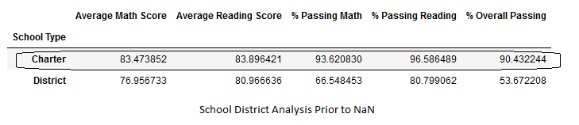
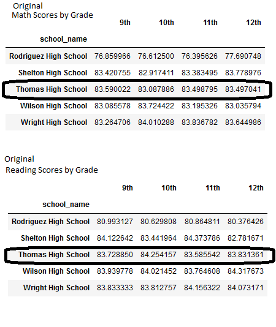
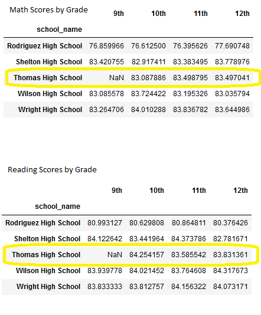
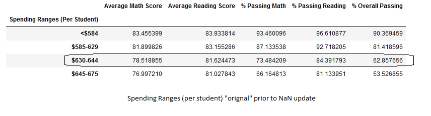
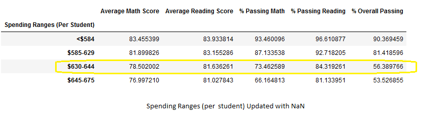

# School_District_Analysis

Maria needs assistance analyzing data from several school districts on their performance trends for math and reading for their standardized testing proficiency. Assisting Maria with data regarding school funding and student performance on standardized tests. These performance analyses will be sent to the school board to determine funding the budget allotments. I am using python library for data manipulation and analysis. In Jupyter Notebook I read raw data, clean and inspect data, merge data sets, perform calculations, and create tables. With this data inside Jupyter Notebook the data can be changed in layout and structure, organized by type, formatted rows and or columns, and sort or group data. Inside this notebook I've imported the Pandas library. With Pandas I've optimized performance, since it's very flexible, and these functions exceed those from Excel.
The following school analysis follows FERPA protections of personalized student performances. My Orignal analysis from Maria included values from the 9th graders at Thomas High school that were Not a Number thus the reanlysis and removal of these 9th grade math and reading scores from the total. The following differences were found once these freshman scores were removed. 

## PyCity School district Summary
I find there are no differences in the district type from the original PyCitySchools analysis to the Challenge analysis. On the charter type, however, changes were found after the Thomas High School 9th grade errors were removed from the math and reading grades and replaced with NaN values. Without these values from the 9th graders from Thomas High school the Overall Passing percentange dropped from 90.4% to 87.2%.

See differences on the Charter level. The original values are 83.474 average math and 83.896 average reading and these are updated to 83.465 average math and 83.902 average reading scores. The influence of the NaN values are seen mostly in the overall passing percentage. 

## School Summary 

How does replacing the ninth graders’ math and reading scores affect Thomas High School’s performance relative to the other schools? Thomas High School's percentages were over 90% passing overall ranking as one of the top schools. Percent passing math 93.3% and an impressive 97.3% passing reading. I'm sorry to find these numbers inflated with incorrect values regarding their 9th grade scores which were removed. Note how the Averages across the board held nearly the same values, but in the percentages were reductions. 

## Thomas High school moves down the list from 2nd in the district down to position 8.

Note how the averages were very similar and the overall percentages took a hit without any ninth grade scores in the count. 
### How does replacing the ninth-grade scores affect the following:
*Math and reading scores by grade*

Note that only ninth grade is affected by this query in the Thomas High School. All other schools remain the same as well as other grades. Thomas High school's tenth, eleventh, and twelfth grades are untouched scores. It's ninth grade holds NaN's for reading and math. 
### Scores by school spending

From these spending bin sizes we see how Thomas High school, seen in a previous chart of the $630-644 bin, remains in the same spending range. From this chart we see the greatest influence of their ninth grade NaN's by the drop in overall percentage passing score. 
### Scores by school size
Thomas High School budget has remained the same for all 1635 students. Maria will use these updated results to send to the school board for them to evaluate changes in the school budget. 
### Scores by school type

### Summary:
There are four major changes to note ocne the ninth grade reading and math scores at Thomas High school have been replaced with NaNs. Overall for the school type, Charter we see little adjustment in the average scores but we note the greatest influence in the Overall Passing Percentage. After adjustment the overall passing percent dropped from 90.4% to 87.2% for Charter. Next we see that the budget criteria stayed unfazed. The school spending has remained in the same bin even with an evident drop in overall passing percentage. The Math and Reading scores by grade show how only the ninth grade of Thomas High School show the NaN's everything else remains the exact same. By this overall percentage passing drop we see how Thomas High School's rankings have dropped from second best to eighth position. 

