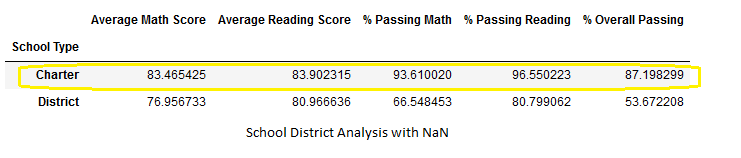

# School_District_Analysis

Maria needs assistance analyzing data from several school districts on their performance trends for math and reading for their standardized testing proficiency. Assisting Maria with data regarding school funding and student performance on standardized tests. These performance analyses will be sent to the school board to determine funding the budget allotments. I am using python library for data manipulation and analysis. In Jupyter Notebook I read raw data, clean and inspect data, merge data sets, perform calculations, and create tables. With this data inside Jupyter Notebook the data can be changed in layout and structure, organized by type, formatted rows and or columns, and sort or group data. Inside this notebook I've imported the Pandas library. With Pandas I've optimized performance, since it's very flexible, and these functions exceed those from Excel.
The following school analysis follows FERPA protections of personalized student performances.

Results: Using bulleted lists and images of DataFrames as support, address the following questions.

## How is the district summary affected?
I find there are no differences on the district level from the original PyCitySchools analysis to the Challenge analysis. On the charter level, however, changes were found after the Thomas High School 9th grade errors were removed from the math and reading grades and replaced with NaN values. 

See minimal differences on the Charter level. The original values are 83.474 average math and 83.896 average reading and these are updated to 83.465 average math and 83.902 average reading scores. 

## How is the school summary affected?

How does replacing the ninth graders’ math and reading scores affect Thomas High School’s performance relative to the other schools?

## Thomas High school moves down the list from position 2 in the district down to position 8.

### How does replacing the ninth-grade scores affect the following:
Math and reading scores by grade

### Scores by school spending

### Scores by school size

### Scores by school type

Summary: Summarize four major changes in the updated school district analysis after reading and math scores for the ninth grade at Thomas High School have been replaced with NaNs.

The written analysis has the following structure, organization, and formatting:

There is a title, and there are multiple sections (2 pt).
Each section has a heading and subheading (3 pt).
Links to images are working, and code is formatted and displayed correctly (2 pt).
Analysis (18 points)
The written analysis has the following:

Overview of the school district analysis:

The purpose of this analysis is well defined (3 pt).
Results:

There is a bulleted list that addresses how each of the seven school district metrics was affected by the changes in the data (10 pt).
Summary:

There is a statement summarizing four major changes to the school district analysis after reading and math scores have been replaced (5 pt).
